# GF_L
使用goframe框架编写的用户登录模块

## 登录逻辑

## 关于为什么要俩次MD5加密+token验证
1. 前端MD5加盐加密+后端不加密
   - 中间人攻击情况下:
     防止直接获取到明文密码,增加使用彩虹表破解的难度(需要分析js文件获取盐)
   
   - 重放攻击:
   
     不防止
   
   - 被脱裤的情况下:
   可以直接用数据库中密码直接登录等于明文密码,在知道从js中知道盐后可以推出明文密码
   
2. 前端后端MD5加盐加密

    - 中间人攻击情况下:

      同只在前端进行MD5加密

    - 重放攻击:

      不防止

    - 被脱裤的情况下:

      不可直接用数据库密码登录,无法通过js反推密码

3. 前端MD5加盐+token+后端MD5加盐

    token在登录时后端传给前端一个临时的token,在登录时带这个token请求后端,后端获取token与session进行比较,一致就删除session中的token,不一致则不让登录

     - 中间人攻击情况下:

       无法用彩虹表破解密码

    - 重放攻击:

      可防止

    - 被脱裤的情况下:

      同前后端MD5加盐加密